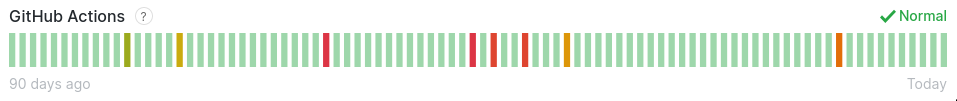

## Motivacija

- Zašto GitHub akcije?
- Kako se automatizuju izrada i ocenjivanje studentskih zadataka?

## GitHub akcije
- tok posla (workflow)
- reagovanje na događaje (create, delete, fork, push, pull_request, release)
- poslovi (jobs)
- koraci (steps)
- kontekst okruženja (github, env, job, steps, runner, secrets)
- Docker i JS akcije
- pokretač (runner)
- prodavnica (marketplace)

## Od čega se projekat sastoji?

- pjisp-­template-­name
- pjisp-diff
- poetry-publish
- smoke-test
- pjisp-assignment-template

## pjisp-assignment-template
- šablonski repozitorijum
- služi za kreiranje i ocenjivanje studentskih zadataka

## pjisp-­template-­name

## pjisp-­template-­name

- Python konzolna aplikacija otvorenog koda
- proverava ispravnost naziva repozitorijuma
- pjisp-{SCHOOL_YEAR}-{COURSE_ID}-{TEST_ID}-{GROUP_ID}

## pjisp­-diff

## pjisp­-diff

- Python konzolna aplikacija otvorenog koda
- proverava da li su promenjene sve datoteke koje je potrebno menjati
- proverava da li su nepromenjene sve datoteke koje se ne smeju menjati

## pjisp­-diff

Datoteke koje je uvek potrebno menjati:

- assignment_solution.c
- assignment.rst

Datoteka koju nije dozvoljeno menjati:

- assignment_notes.rst

## pjisp­-diff

Datoteka koju je potrebno menjati kada se kreira zadatak za T12:

- fixtures/stdio­numbers.yaml

Datoteke koje je potrebno menjati kada se kreira zadatak za T34 ili SOV:

- fixtures/file­-error­-input-­not-­readable.yaml
- fixtures/file­-error­-output-­not-writable.yaml
- fixtures/file­-text.yaml

## poetry-­publish

- GitHub akcija koja pri svakom novom objavljivanju verzije alata na GitHub­u, kreira i novu verziju Python paketa i postavlja je na PyPI repozitorijum

## poetry-­publish

Paramtri koje ova akcija očekuje su

- python_version
- poetry_version
- pypi_token
- repository_name
- repository_url

## poetry-­publish

- u pjisp-template-name i pjisp-diff

```yaml
name: Python package
  on:
    push:
      tags:- 'v*.*.*'
  jobs:
    build:
      runs-on: ubuntu-latest
      steps:
      - uses: actions/checkout@v2
      - name: Change version in pyproject.toml
        run: |
        REF=$(echo ${{ github.ref }} | sed "s#\(refs/tags/\)\?v\?##")
        sed -i "s/^version=\".\+\"/version=\"$REF\"/" pyproject.toml
      - name: Build and publish to pypi
        uses: JRubics/poetry-publish@v1.1
        with:
          pypi_token: ${{ secrets.PYPI_TOKEN }}
```

## smoke_test

- konzolna aplikacija i API koji služi za testiranje studentskih zadataka
- izlazni kod kada dođe do greške

## pjisp-assignment-template

Nove funkcionalnosti:

- assignment­-diff - za proveru da li su izmenjene sve datoteke koje je potrebno menjati i da lisu ostale iste sve datoteke koje se ne smeju menjati
- assignment­-check - za proveru izmena datoteka i proveru ispravnosti primera rešenja
- get-­template - za pronalaženje naziva testa na osnovu naziva repozitorijuma i proveru ispravnosti naziva repozitorijuma

## pjisp-assignment-template

Izmene postojećih funkcionalnosti:

- init­ - dodatno, nakon generisanja datoteka na osnovu izabranog identifikatora testa, kreira se .template datoteka u koju se smešta identifikator za kasniju upotrebu
- test-­solution­ - dodato je da pre pokretanja funkcionalnosti zahteva da postoji assignment_solution.c datoteka
- assignment-­build­ - dodato je da pre pokretanja funkcionalnosti zahteva da postoji assignment_solution.c datoteka
- assignment-­pack -­ dodato je da se pre pakovanja, pored provere ispravnosti primera rešenja, proveri da li su izmenjene sve datoteke koje je potrebno menjati i da li su ostale iste svedatoteke koje se ne smeju menjati

## pjisp-assignment-template

Dodate zavisnosti u projektu upotrebom Pipenv-a:

- pjisp­-template-­name - poziva ga get-­template funkcionalnost sa nazivom repozitorijuma kao ulaznim parametrom i identifikatorom testa kao povratnom vrednošću
- pjisp­-diff - poziva ga assignment-diff funkcionalnost sa identifikatorom testa kao ulaznim parametrom

## pjisp-assignment-template

GitHub akcije:

- Project create
- PJISP assignment

## Project create

## Project create

- postavlja inicijalno stanje projekta
- na osnovu identifikatora testa kreiraj datoteke namenjene tom testu
- kreira bedž u README.rst datoteci

## Project create

- jedan posao koji se sastoji od šest koraka
- pokreće se na Ubuntu operativnom sistemu na "create" događaj

## Project create koraci 1, 2, 3

```yaml
- uses: actions/checkout@v2
- name: Set up Python 2.7
  uses: actions/setup-python@v1
  with:
    python-version: 2.7
- name: Install pipenv
  uses: dschep/install-pipenv-action@v1
```

## Project create korak 4

```yaml
- name: init_template
  run: |
  REPO=$(echo ${{github.repository}} | cut -d "/" -f 2)
  pipenv install
  TEMPLATE=$(pipenv run make get-template repo_name=$REPO)
  pipenv run make init template=$TEMPLATE
```

## Project create korak 5

```yaml
- name: add_badge
  run: |
  REPO=${{github.repository}}echo "|Actions Status|
  .. |Actions Status| \image:: \
    https://github.com/ \
    $REPO/workflows/PJISP%20assignment/badge.svg
    :alt: CPython build status on GitHub Actions
    :target: https://github.com/$REPO/actions
  " | cat - README.rst > README
  mv README README.rst
```

{ width=150% }

## Project create korak 6

```yaml
- name: push_changes
  run: |
  git config --global user.email "action@github.com"
  git config --global user.name "github"
  git add .
  git commit -m "Init template"
  git push
```

## Project create završetak

- po izvršavanju celog ovog toka poslova, repozitorijum je spreman za preuzimanje i kreiranje studentskog zadatka
- bedž u početku ima "failing" vrednost, pošto zadatak nije spreman za studente i očekuje se od nastavnog osoblja da ga kreira

## PJISP assignment

## PJISP assignment

- nakon izmene koda na repozitorijumu proveri da li je repozitorijum spreman za pregledanje od strane nastavnika i davanje studentima na rad
- proverava ispravnost primera rešenja
- menja status bedž-a

## PJISP assignment

- jedan posao koji se sastoji od četiri koraka
- pokreće se na Ubuntu operativnom sistemu na "push" ili "pull-request" događaj

## PJISP assignment koraci 1, 2, 3

```yaml
- uses: actions/checkout@v2
- name: Set up Python 2.7
  if: ${{!contains(github.repository,'pjisp-assignment-template')}}
  uses: actions/setup-python@v1
    with:
      python-version: 2.7
- name: Install pipenv
  if: ${{!contains(github.repository,'pjisp-assignment-template')}}
  uses: dschep/install-pipenv-action@v1
```

## PJISP assignment korak 4

```yaml
- name: Run test
  if: ${{!contains(github.repository,'pjisp-assignment-template')}}
  run: |
    pipenv install
    pipenv run make assignment-check
```

## PJISP assignment završetak

- menja status bedža na osnovu uspešnosti izvršavanja testova

## primer upotrebe

## zaključci

- akcije nisu u potpunosti pouzdane

- dokumentacija nije uvek usklađena sa alatom
- jednostavna upotreba

## Hvala na pažnji
